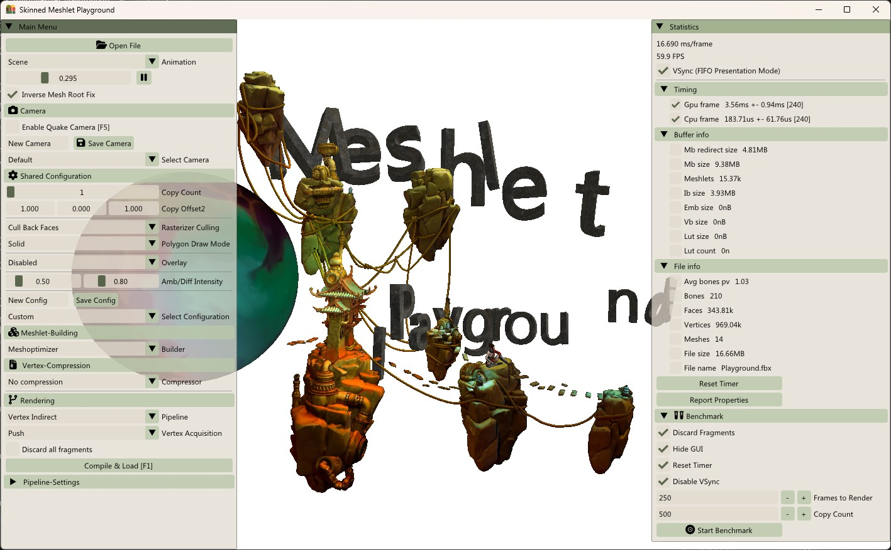
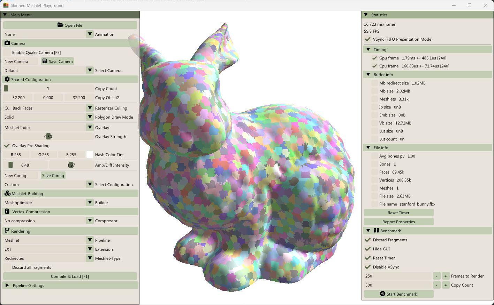
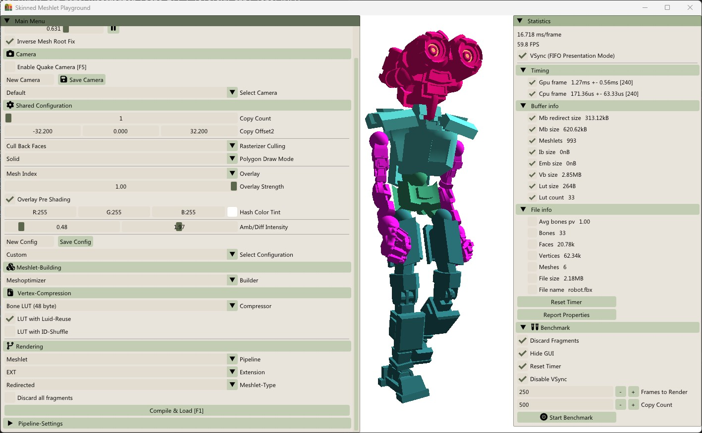

#  Meshlet Playground

 [](https://github.com/GeraldKimmersdorfer/meshlet_playground) [](https://github.com/GeraldKimmersdorfer/meshlet_playground)  

This repository contains a tool developed for my Bachelor thesis on compressing vertex attributes of skinned meshes for rendering with the mesh shading pipeline. It implements and benchmarks several state-of-the-art compression schemes for blend attributes (bone indices/weights) and other vertex data on top of meshlets.

> Gerald Kimmersdorfer. *Vertex Compression with Mesh Shaders for Skinned Meshes*. Bachelor Thesis, Research Unit of Computer Graphics, Institute of Visual Computing and Human-Centered Technology, Faculty of Informatics, TU Wien, 2024. [[thesis page]](https://www.cg.tuwien.ac.at/research/publications/2024/kimmersdorfer-2024-vcpr/)

| | | |
|:---:|:---:|:---:|
|  |  |  |

[](https://www.cg.tuwien.ac.at/research/publications/2024/kimmersdorfer-2024-vcpr/kimmersdorfer-2024-vcpr-thesis.pdf) [](https://github.com/GeraldKimmersdorfer/meshlet_playground/releases/download/v1.0/MeshletPlayground-v1.0-win64.zip)

This project's own code is licensed under the MIT License. Have fun with it.

## Development Setup

### Prerequisites
 - Windows 10 or 11
 - Visual Studio 2022 with the **Desktop development with C++** package (v143 toolset)
 - A [Vulkan SDK from LunarG](https://vulkan.lunarg.com/sdk/home#windows). with the **Vulkan Memory Allocator** (VMA) component. (tested with 1.4.328.1)
 - [CMake](https://cmake.org/)

### Installation
```
git clone https://github.com/GeraldKimmersdorfer/compressed_meshlet_skinning && cd compressed_meshlet_skinning
git submodule update --init --recursive
cmake -S meshoptimizer/ -B meshoptimizer/build
start compressed_meshlet_skinning.sln
```
> [!Important]
> - Make sure that the working directory of the `compressed_meshlet_skinning` project is set to *$(OutputPath)* (for all configurations!!)
> - **If the first build is stuck** (usually on the *Post Build Helper* custom build step for several minutes with no progress), cancel it and start the build again. A second attempt with warm cache usually works.
> - At the first build, the [_Post Build Helper_](auto_vk_toolkit/visual_studio/README.md#post-build-helper) tool (part of Auto-Vk-Toolkit) builds and then deploys assets/shaders to the output directory. Watch Visual Studio's *Output* tab for its progress and the popup in the tray icon
